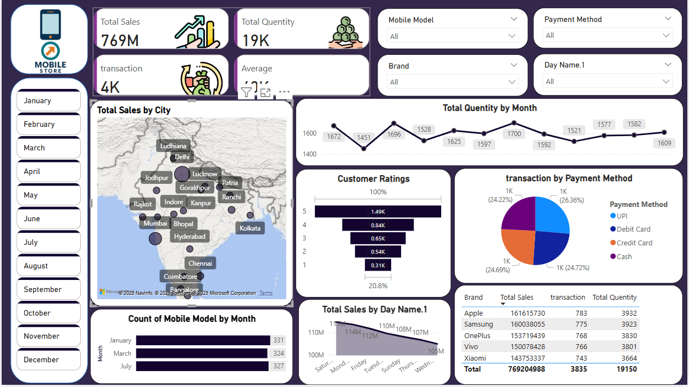
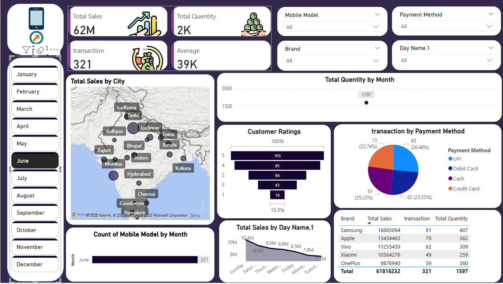

 📊 Mobile Sales Dashboard (Power BI)

An interactive **Power BI dashboard** analyzing mobile retail sales.  
This project demonstrates skills in **data cleaning, modeling, DAX, and dashboard design** while delivering clear **business insights**.

---

## 📷 Dashboard Preview

(Additional view: )

---

## 🔍 Key Insights
- ₹769M in **Total Sales**
- 19K+ **Units Sold**
- 4K+ **Transactions**
- **Top-performing Brands & Models**
- **City-wise sales** mapped across India
- **Payment method analysis** (UPI, Cash, Cards)
- **Monthly & Daily trends**
- **Customer ratings breakdown**

---

## 🛠 Files in this Repo
- `Mobile Sales Dashboard.pbix` → Power BI dashboard file  
- `Mobile_Sales_Dashboard_Data.xlsx` → Dataset used for analysis  
- `Main_Dashboard.png` → Main dashboard screenshot  
- `Preview.png` → Additional preview image  
- `README.md` → Documentation  

---

## 🛠 Skills Applied
- Power Query for data preparation  
- DAX formulas for KPIs & calculated measures  
- Data modeling (Fact & Dimension design)  
- Designing **interactive reports** with slicers & filters  

---

## 🎯 Business Value
This dashboard helps stakeholders in mobile retail:  
- Track sales by brand, model, city, and time  
- Identify high-performing products  
- Analyze customer ratings & satisfaction  
- Understand payment method preferences  

---

## 🚀 How to Use
1. Clone/download this repo  
2. Open `Mobile Sales Dashboard.pbix` in **Power BI Desktop**  
3. Explore visuals interactively with slicers & filters  

---
